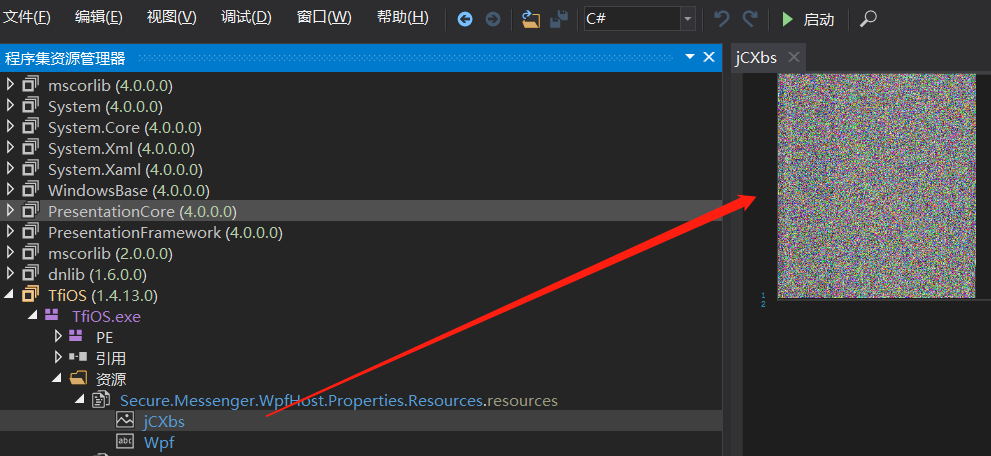

话说前几天我正在构思写个小工具把隐藏在png图片中的信息解出来，突然“叮咚”一声，我的一位好友BYD给我发了个名为某手在线指导之越练越肥视频链接，我赶紧回了一句“上班呢！”，之后默默打开了手机独自欣赏起来，完事之后我就在想不如写个小工具即能够隐写信息，有能够解出来多好玩。哎！你看背弃了初衷，谁人都可以不是。

废话少说，开扯！至于为啥有这个想法，主要是因为发现最近的好多.net病毒其中有个手段就是将一些关键代码隐藏在png图片中，并将其作为资源内嵌到程序中，在主程序中对其进行解密之后进行调用。比如这样：

那我我们大概看下这个病毒吧，这个病毒相对简单一些，关键点也容易找些，即使被混淆了，也还能看。关键是de4dot能脱壳，对我后面拷贝他接出来的dll代码起了很大作用，哈哈！

可以看到这里并不是对图片直接进行解密，而是通过先解另外一个资源之后并调用了其中的“StartGame”函数。所以我就把他解出来的文件保存了一份进行分析。结果和预想相同是个dll文件，之后我本想调试着来看，但是有其他需求，所以索性把他的dll代码修改了成exe文件，当然资源我也进行了内嵌，毕竟没资源解个锤子。

这就是StartGame函数了，我把延时操作和调用病毒代码给注释掉了。

这里就比较明显了，调用GetPixel函数来获取每个像素点的RGB值最后组成病毒代码，当然这个病毒解到这里还不是最终的代码，而是被压缩过的代码，但是不是此次重点就不深究了。
接下来我想的是这个RGB到底是从哪里来的呢？所以我加了一段Write函数将其得到的RGB的值写入到文件中，看看能不能得到有用的信息。

之后我随便找了一个在线的RGB取色器，输入其获取的RGB值，发现其在纵向获取像素点中的RGB值。

接着我打开了010Editor对这些值进行了搜索，结果并没有找到。想想也是，怎么可能这么简单的直接把三色值存储到二进制文件中。好吧，去网上查查png图片的格式，查了一圈大概就是png有几个比较重要的块，有想详细了解的朋友，网上好多资料，这里就不说了，文件格式标志位，IHDR头描述图片的像素大小，像素深度，以及图片的透明度。IHDR尾是固定的12个字节。IDAT就是最重要的块了，其中存储图片的关键数据。到这就确定了方向就是寻找如何解析IDAT块中的数据！
找了一大圈关于IDAT块的相关信息，结果很多都说如果了解IDAT块就能构造一个png图片了，害，我tm也是这么想的呢！算了，继续找吧，终于在stackoverflow上找到了一篇帖子，这个是个很有趣的问题，我来给大家翻译一下，机翻真的蛋疼啊！
先放原帖子链接：https://stackoverflow.com/questions/49017937/png-decompressed-idat-chunk-how-to-read

下面是一个哥们的回复：

至此，我得到了写小工具相关的有用信息，就是IDAT块数据的来源是调用了zlib库函数进行了压缩，还有一个细节就是图中所说的计算方法，224+227 = 195？？？  215+241 = 200？？？其实是当两者相加超过256时候要剪掉256才是最终的结果！其实我也不清楚为啥，深入看算法从来不是我强项，索性就算了，但是不影响我写工具即可，哈哈！
终于可以开始构造我的png了！这次我采用python来写，重要的是我并不会使用python，所以我都是边上网查编写，过程说实在的有点困难，此次会上传我的源码和成品，我会尽量把注释写的详细写，先声明代码能看不能学，懂我意思吧（手动狗头）！
写到这里，我觉着我还有好多想写的，但我我突然意识到我写不下去了，因为想说的都在代码里了，一切结束的这么突然，哈哈！反正就说下思路和注意点吧，其实png的块构成很简单，这次我采用最简单的三块，IHDR.IDAT.IEND，然后将一些不变的数据搞成结构体，方便写入，比如IHDR和IEND中的一些数据。需要注意的是，IHDR和IDAT中的参数都是大端序存储，所以程序中需要注意，还有就是png中crc校验，代码我是在网上扒的，本来想用之前从病毒中弄下来计算crc代码的，但是010会提示crc错误，为了优雅，还是改掉了。

最后展示一下成品吧！
~~~
W3B.exe -z [file] -k [key]
参数说明：
-z 压缩文件
-k文件密钥

W3B.exe -j [file] -k [key]
参数说明：
-j 解压文件
-k文件密钥（和压缩密钥对应）

-k参数可以不给
~~~
先用key = 6进行转换，成功之后会生成，compress_1.bin文件，之后改成.png后缀就行了

compress_1.bin

之后用key = 6进行解压，成功之后会生成decompress_1.bin文件，之后改成指定格式的后缀即可，temp文件可以不用管，中间文件，不想删了。

我也尝试过压视频，只不过测试视频大小只有16M，再大的视频没试过，主要是有点慢！有兴趣的小伙伴可以试试，可能有bug哈哈！