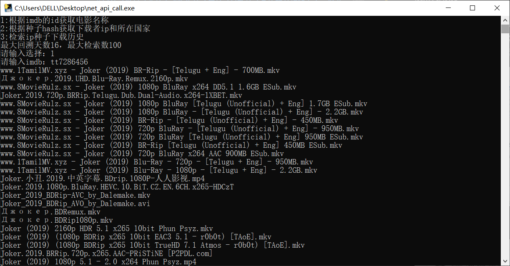
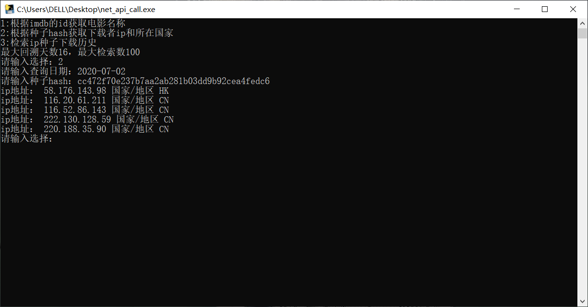
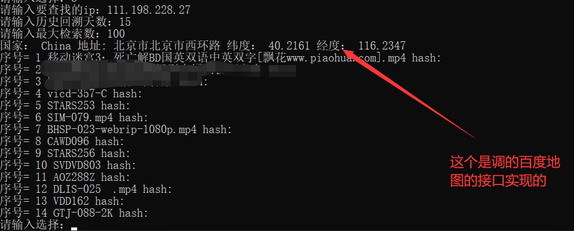

# 网站概览
## 网址：https://iknowwhatyoudownload.com/
## 网站介绍
### 此网站可以记录两种方式收集种子信息（包括种子具体的名称和大小，以及记录下载种子的ip地址（公网ip形式）），一个是解析种子网站，另外一个是HDT网络。网站首页会显示处于这个公网ip中的所有种子下载相关信息。

### ip公网覆盖

## 网站接口介绍
### 网站接口调用，首先需要一个key用来后续的数据请求时使用

### 获取key之后就可以看接口相关文档了

## 网站接口调用，不全部实现，只是简单的调用了几个（python）
### 第一个是通过imdb的影片id获取所有电影资源种子名称 

### https://www.imdb.com/title/tt7286456/?ref_=hm_rvi_tt,这是一部imdb上的电影《小丑》，其中tt7286456就是该影片在imdb上的id了

```
#根据imdb获取相关信息
def getinfobyimdb():
    imdb = input("请输入imdb：")
    url = "https://api.antitor.com/torrent/list/"
    new_url = url + "imdb/"+ imdb + "?key="+ key
    res = requests.get(new_url)
    json_data = json.loads(res.text)
    for i in json_data['torrents']:
        print(i['name']) 
```
### 效果


### 第二个就是通过电影的hash值检索那些公网ip对这个资源进行了下载
### 参数包括hash值和具体日期
```  
#通过hash查询种子被下载的ip地址以及所在国家
def getipinfobyhash():
    #https://api.antitor.com/torrent/downloads/
    url = "https://api.antitor.com/torrent/downloads/"
    day_data = input("请输入查询日期：")
    info_hash = input("请输入种子hash：")
    new_url = url+info_hash+"?key="+key+"&day="+day_data+"&days=11&short=false"
    res = requests.get(new_url)
    json_data = json.loads(res.text)
    if len(json_data) == 2:
        print("获取失败！",json_data['message'])
    else:
        for i in json_data['peers']:
            print("ip地址：",i['ip'],  "国家/地区",i['countryCode'])
```
### hash就是磁力链接的其中一部分
### magnet:?xt=urn:btih:cc472f70e237b7aa2ab281b03dd9b92cea4fedc6&dn=移动迷宫3：死亡解BD国英双语中英双字[飘花www.piaohua.com].mp4
### 可以去飘花资源网找hash来测试
### 其中cc472f70e237b7aa2ab281b03dd9b92cea4fedc6就是种子hash值
### 效果


### 第三个就是查询某个ip地址在过去一段时间下载了什么内容
### 参数1：ip地址
### 参数2：回溯天数
### 参数3：内容条数
### 效果


## 完成代码实现见
 [main.py](./film/net_api_call.py)


